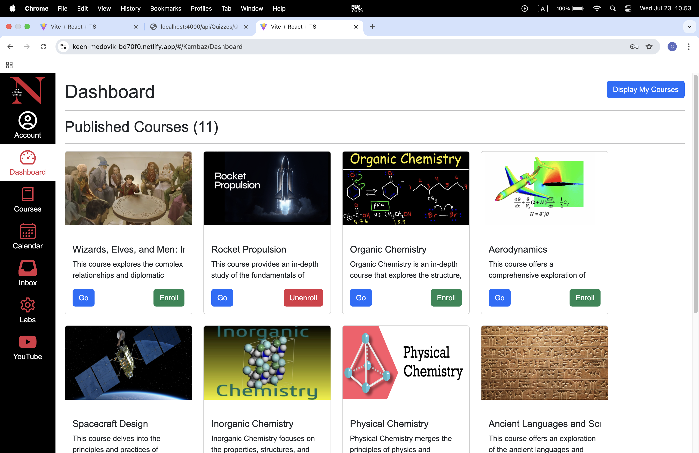
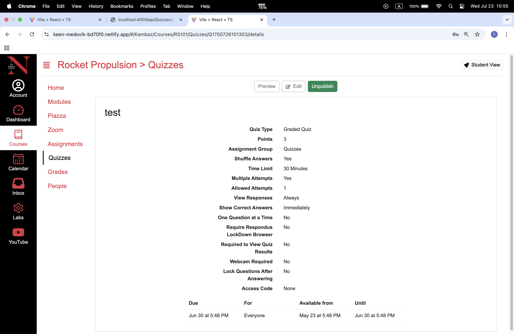
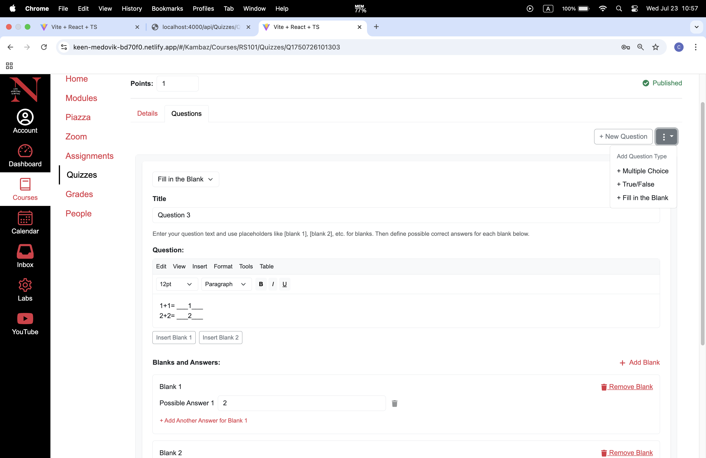
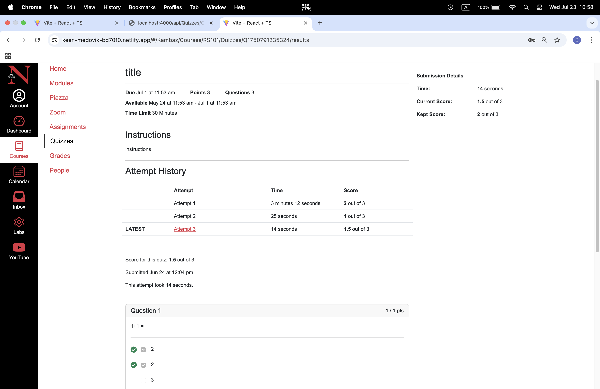

# Kambaz

Kambaz is a rudimentary version of the widely acclaimed Learning Management System (LMS), Canvas. 
This full-stack application provides an educational platform with features including interactive quizzes, course management, and assignments. The system supports multiple user roles - students, faculty, and administrators - each with tailored features and permissions. This repository contains the frontend client application and requires the backend server to be running for full functionality. Here's the [link](https://github.com/clarisseli/kambaz-node-server-app) to the backend repository. 

## Table of contents
1. [Demo](#demo)
2. [Screenshots](#screenshots)
3. [Tech Stack](#tech-stack)
4. [Notable Features](#notable-features)
5. [Building and Running the App](#building-and-running-the-app)

## Demo
[Link to live demo](https://keen-medovik-bd70f0.netlify.app)

**Demo Credentials:**
- Student: `ada` / `123`
- Faculty: `iron_man` / `stark123`
- Admin: `admin` / `admin123`

## Screenshots

### Dashboard

*The dashboard displays enrolled courses for students, created courses for faculty, and all courses for admin. Students can enroll/unenroll in courses, faculty can edit their created courses.*

### Quiz Details

*Faculty can view the quiz details, and publish/unpublish the quiz*

### Quiz Editor

*Faculty can create quizzes with multiple question types including multiple choice, true/false, and fill-in-the-blank*

### Taking a Quiz

*Students can take quizzes with automatic grading and instant feedback*


## Tech Stack
- **TypeScript** for type-safe development
- **React** for building the user interface
- **Redux** for global state management
- **React Router** for navigation and routing
- **React Bootstrap** for responsive design and styling
- **Axios** for HTTP requests to the backend API
- **React Icons** for consistent iconography

## Notable Features

### 🔒 Role-Based Access Control
The application implements three distinct user roles with specific permissions:
- **Student** can browse courses, enroll/unenroll in classes, submit assignments, and take quizzes
- **Faculty** can create courses, design quizzes, manage assignments and modules
- **Admin** have full access to user and course informations

### 📚 Comprehensive Quiz System
Our quiz module supports multiple question types and configurations:
- Multiple choice questions (single or multiple correct answers)
- True/false questions
- Fill-in-the-blank questions with multiple acceptable answers
- Configurable attempts, time limits, access codes, etc
- Automatic grading with detailed results

### 🎨 Modern User Interface
The application features a clean, intuitive design that closely mirrors professional LMS platforms, making it immediately familiar to users of Canvas or similar systems.

### 🛡️ Secure Navigation
Protected routes ensure that only authenticated users can access course content. The system automatically redirects unauthenticated users to the login page when attempting to access restricted areas.

### 📸 Course Image Management
Faculty can upload custom images for their courses, creating a more engaging visual experience on the dashboard.

## Building and Running the App

### Prerequisites
Before you begin, ensure you have the following installed:
- **Node.js** - [Download here](https://nodejs.org/)
- **npm** (comes with Node.js)
- **Git** for cloning the repository

### Backend Setup
This frontend application requires the backend server to be running. Follow these steps:

1. Clone and set up the backend server from the [backend repository](https://github.com/clarisseli/kambaz-node-server-app)
2. Ensure the backend is running on `http://localhost:4000` before proceeding

### Frontend Setup Instructions

1. **Clone the repository**
   ```bash
   git clone https://github.com/clarisseli/kambaz-react-web-app.git
   cd kambaz-react-web-app
   ```

2. **Install dependencies**
   ```bash
   npm install
   ```

3. **Configure environment variables**
   
   Create a `.env` file in the root directory with the following content:
   ```env
   VITE_REMOTE_SERVER=http://localhost:4000
   ```
   
   If your backend runs on a different port or URL, update accordingly.

4. **Start the development server**
   ```bash
   npm run dev
   ```

5. **Access the application**
   
   Open your browser and navigate to:
   ```
   http://localhost:5173
   ```

### Verification Steps
1. The application should load without errors
2. Try logging in with one of the demo credentials
3. If you see a "Network Error", ensure your backend server is running


## Author
**Clarisse Li**
- GitHub: [@clarisseli](https://github.com/clarisseli)
- LinkedIn: [Clarisse Li](https://www.linkedin.com/in/mengru-clarisse-li/)

